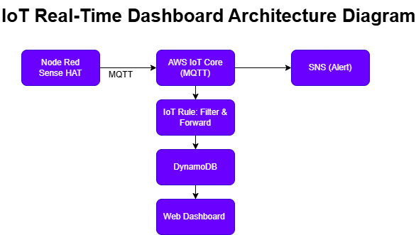

# IoT Real-Time Analytics

## Project Summary
This project shows how you can collect sensor data from a virtual Raspberry Pi (Sense HAT simulator using Node-RED), send it to the AWS cloud, store and analyze it, trigger alerts, and view everything in a web dashboard.

## System Overview

**Components:**
- **Node-RED + Sense HAT Simulator:** Generates sensor data (temperature, humidity, pressure, latitude, longitude) and sends it to AWS IoT Core.
- **AWS IoT Core:** Receives device data via MQTT.
- **IoT Rule:** Forwards data to DynamoDB and sends alerts to SNS (email) if temperature > 35°C or humidity > 80%.
- **DynamoDB:** Stores all incoming IoT data.
- **SNS:** Sends out email notifications for alert conditions.
- **Web App (Node.js + Express + Chart.js):** Gets data from DynamoDB, shows latest values, aggregates, charts and alerts.

## Architecture Diagram




## Key Features

- Collects and sends data from three sensors plus location.
- Stores all observations with timestamps in DynamoDB.
- Sends email if temperature or humidity get too high.
- Web dashboard displays:
  - Latest sensor values
  - Min/Max/Avg for the last hour
  - Separate chart for each sensor
  - Visual alert if threshold is exceeded

## How to Run

1. **Clone repository & install dependencies:**
   ```sh
   git clone https://github.com/deepakchandra30/iot-real-time-analytics.git
   cd iot-real-time-analytics
   npm install
   ```
2. **Start web app:**
   ```sh
   node app.js
   ```
   - Dashboard: [http://localhost:3000](http://localhost:3000)

3. **Start Node-RED Sense HAT Simulator:**
   - Run `node-red`
   - Go to [http://localhost:1880](http://localhost:1880)
   - Deploy the simulation flow.  
     (This will connect to AWS IoT and send sensor data.)

4. **Make sure AWS IoT Core, DynamoDB, and SNS are set up as described above.**

5. **Open the dashboard for live analytics, charts, and alerts.**

## Demo Video

**YouTube Demo:** [LINK_TO_YOUR_VIDEO](https://youtube.com/...)

## Notes

- Email alerts are triggered by AWS SNS when thresholds are broken.
- System works with any sensors Node-RED can simulate.
- See comments in code for further details.
